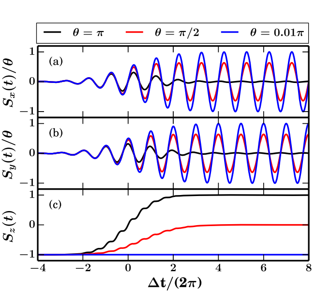
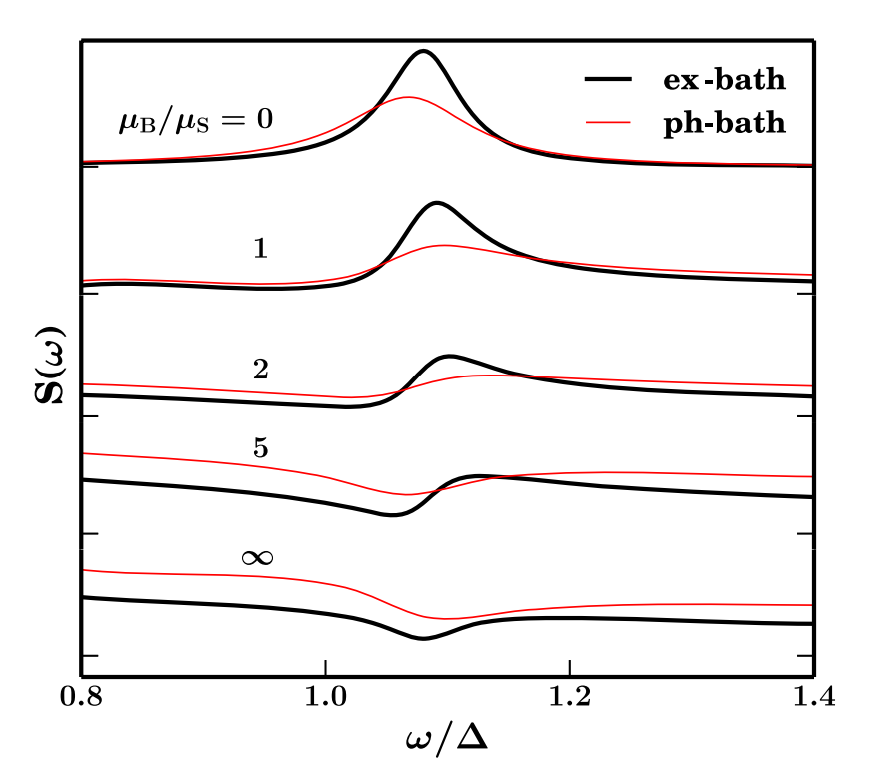
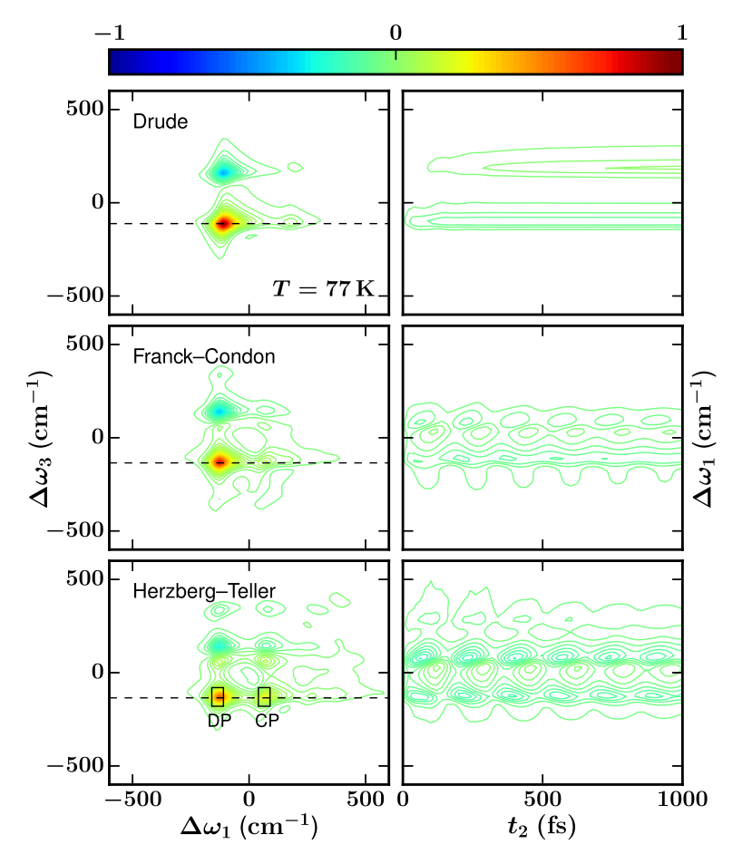
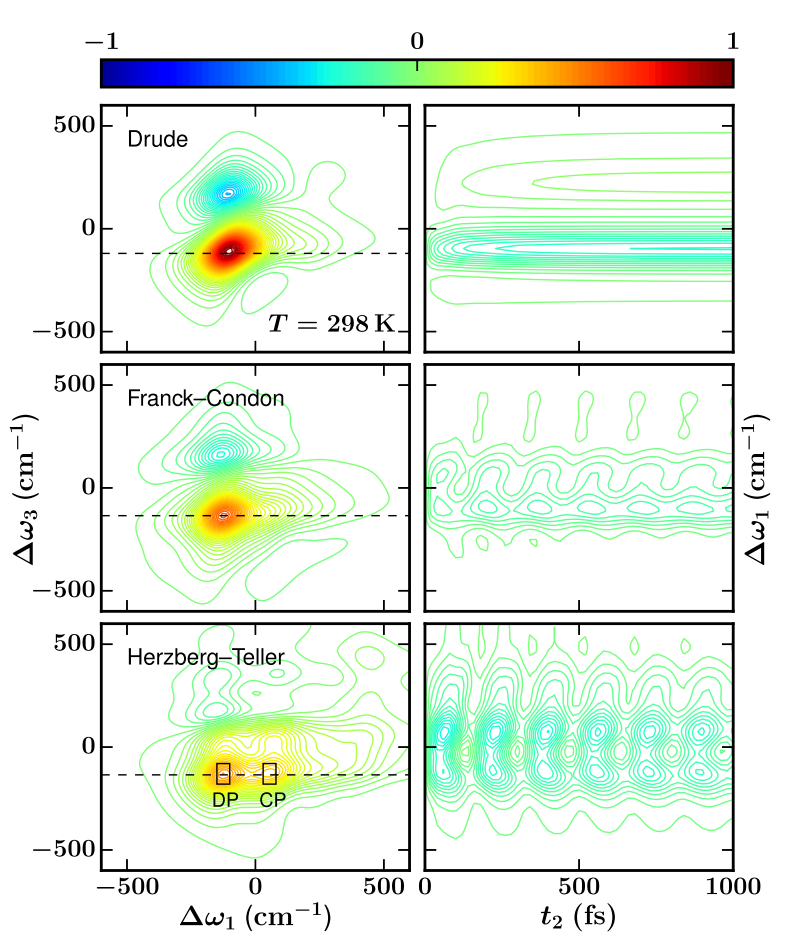

# Applications

## Fano interference

In this work, to study the entangled system and bath polarization and nonlinear Fano interference, 
we incorporate further the time-dependent light field, which interacts with both the molecular system andthe collective bath dipoles directly. 
[[J. Chem. Phys. 142, 024112 (2015)]](http://dx.doi.org/10.1063/1.4905494){target=_blank}

{: .center style="height:285px"}
{: .center style="height:285px"}

### Two-dimensional spectroscopy with non-Condon vibronic coupling

In this work, we study the effects of non-Condon vibronic coupling on the quantum coherence
of excitation energy transfer, via the exact dissipaton-equation-of-motion evaluations on excitonic
model systems.
[[J. Chem. Phys. 145, 204109 (2016)]](http://dx.doi.org/10.1063/1.4968031){target=_blank}

{: .center style="height:385px"}
{: .center style="height:385px"}

## Quantum thermodynamics

This work presents a unifed DEOM theory and its evaluations on the Helmholtz free energy change due
to the isotherm mixing of two isolated subsystems.
[[J. Chem. Phys. 153, 154111 (2020)]](http://dx.doi.org/10.1063/5.0021203){target=_blank}
