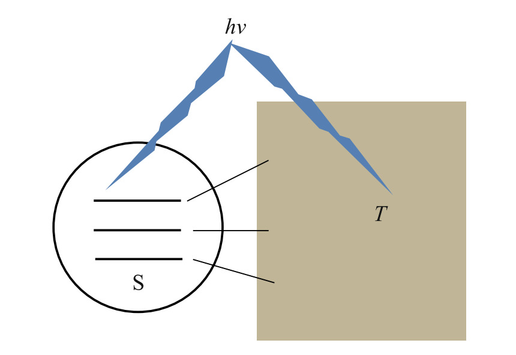
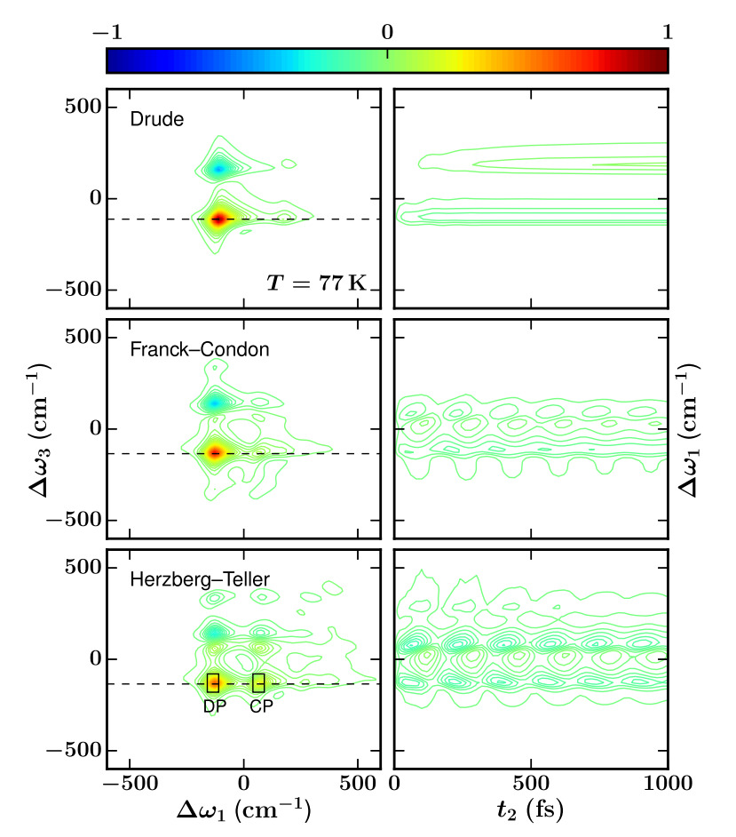

# Dissipaton Equation of Motion (DEOM)

## A versatile approach to entangled system—environment dynamics

{: .center style="height:185px"}
{: .center style="height:185px"}
{: .center style="height:185px"}

* [Group of Open Quantum Dynamics](http://openquan.ustc.edu.cn/){target=_blank}

* Email: <yanyj@ustc.edu.cn>&nbsp;&nbsp;&nbsp;<rxxu@ustc.edu.cn>&nbsp;&nbsp;&nbsp;<xz58@ustc.edu.cn>

&NewLine;

* [University of Science and Technology of China](https://www.ustc.edu.cn/){target=_blank}

* Postal address: No.96, JinZhai Road Baohe District, Hefei, Anhui, 230026, China.
